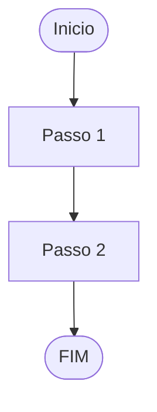

# Prompt: Gerar Treinamentos

## Objetivo

Gerar material de treinamento completo para fluxos do Odoo 16, incluindo versao HTML com diagramas Mermaid e versao Markdown.

## Template de Referencia

Usar como base:
- `templates/treinamento.html` (versao visual)
- `templates/treinamento.md` (versao documentacao)

## Instrucoes

### 1. Estrutura do Treinamento

O treinamento deve conter:

```markdown
# TREINAMENTO: {TITULO}

## Sumario
- Tabela de modulos envolvidos

## PARTE 1: Configuracao Inicial
- Etapas de setup (uma vez)

## PARTE 2: Fluxo Completo
- Etapas do fluxo principal

## PARTE 3: Situacoes Especiais
- Cancelamentos, devolucoes, alteracoes

## PARTE 4: Erros Comuns e Solucoes
- Tabela de erros

## PARTE 5: Fluxo Resumido
- Diagrama em texto ou Mermaid

## Referencia: Modulos Envolvidos
- Tabela de modulos
```

### 2. Elementos Obrigatorios

Cada treinamento DEVE conter:
- [ ] Hero com titulo e modulos
- [ ] Nav com links para secoes
- [ ] Pelo menos 2 diagramas Mermaid
- [ ] Pelo menos 5 etapas passo a passo
- [ ] Caminhos de menu (`Menu > Submenu > Opcao`)
- [ ] Alertas coloridos (info, warning, success, error)
- [ ] Tabela de erros comuns
- [ ] Grid de modulos envolvidos
- [ ] Checklist de qualidade

### 3. Formato das Etapas

Cada etapa deve seguir:

```markdown
### Etapa X.X — Titulo da Etapa

**Menu:** Caminho > Do > Menu

1. Passo 1
2. Passo 2
3. Passo 3

> **Tipo do Alerta:** Texto de observacao.
```

### 4. Tipos de Alerta

| Classe | Cor | Uso |
|--------|-----|-----|
| `.alert-info` | Azul | Informacoes uteis |
| `.alert-warning` | Laranja | Atencao/Cuidado |
| `.alert-success` | Verde | Resultado esperado |
| `.alert-error` | Vermelho | Erro/Critico |

### 5. Diagramas Mermaid

Incluir pelo menos:
- **Fluxo Geral:** Visao completa do processo
- **Fluxo Detalhado:** Etapas especificas
- **Fluxo de Decisao:** Pontos de escolha
- **Fluxo de Erros:** Tratamento de excecoes

Exemplo:


### 6. Conteudo por Tipo de Fluxo

**Vendas:**
- Orcamento → Pedido → Estoque → Fatura → NF-e → Pagamento

**Compras:**
- RFQ → Pedido → Recebimento → NF-e Entrada → Fatura → Pagamento

**Estoque:**
- Entradas, Saidas, Transferencias, Inventarios, Lotes

**NF-e:**
- Configuracao, Emissao, Cancelamento, Carta de Correcao

### 7. Exemplo de Uso

**Entrada:**
- Fluxo: Vendas
- Modulos: sale, sale_stock, l10n_br_sale

**Saida:**
- Arquivo HTML: `01-vendas.html`
- Arquivo MD: `01-vendas.md`
- Conteudo: Treinamento completo seguindo o template

### 8. Checklist de Qualidade

- [ ] Template HTML e MD seguidos
- [ ] Diagramas Mermaid funcionais
- [ ] Etapas claras e objetivas
- [ ] Caminhos de menu corretos
- [ ] Alertas apropriados
- [ ] Modulos listados corretamente
- [ ] Erros comuns documentados
- [ ] Fluxo resumido incluido
- [ ] Formatacao consistente

---

*Prompt para geracao de treinamentos — Odoo 16 Localizacao Brasileira OCA*
