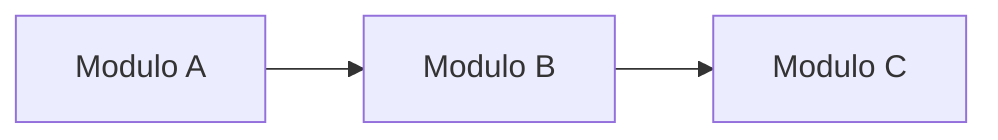

# {{AREA_TITULO}}

{{AREA_DESCRICAO}}

## Modulos nesta Area

| Modulo | Descricao | Tipo |
|--------|-----------|------|
| `modulo_1` | Descricao do modulo | Escodoo / OCA / Odoo SA |
| `modulo_2` | Descricao do modulo | Escodoo / OCA / Odoo SA |

---

## Documentacao de Modulos

- [Modulo 1](modulo_1.md) — Descricao
- [Modulo 2](modulo_2.md) — Descricao

---

## Dependencias

---

*Documentacao gerada automaticamente — Odoo 16 Localizacao Brasileira OCA*
