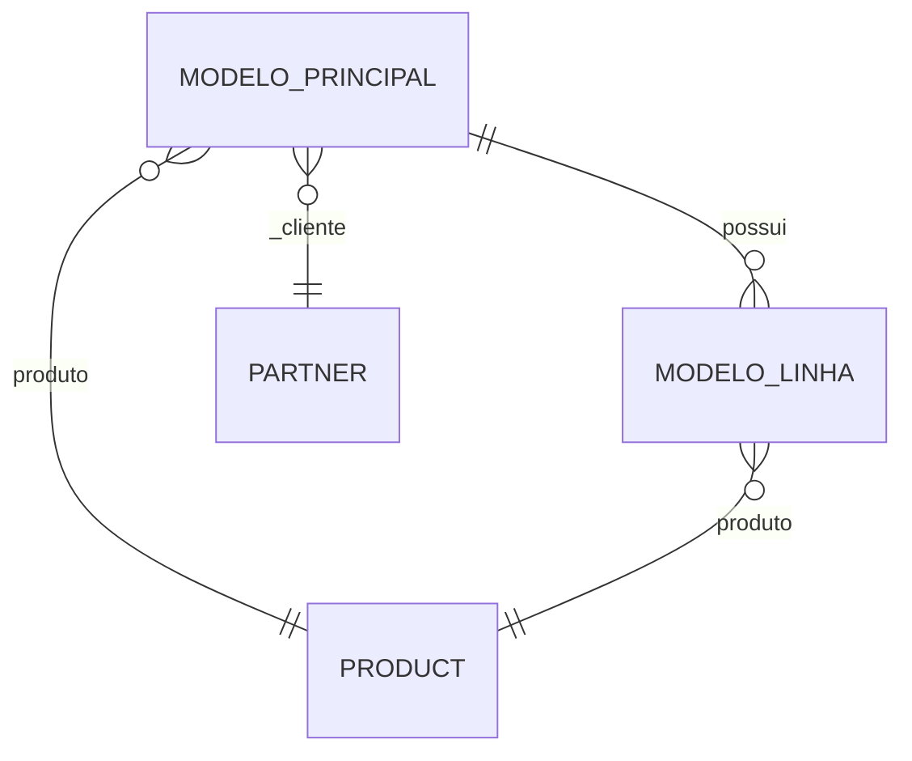
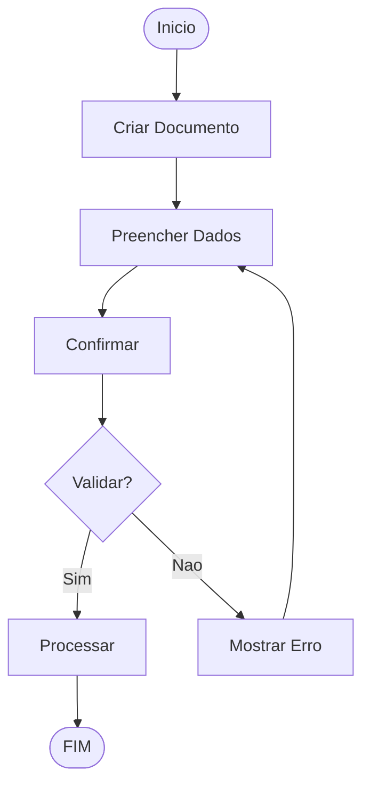

# Especificacao Tecnica: {{MODULO_NOME}}

{{MODULO_DESCRICAO}}

## Sumario

- [Visao Geral](#visao-geral)
- [Modelos de Dados](#modelos-de-dados)
- [Logica de Negocio](#logica-de-negocio)
- [Integracoes](#integracoes)
- [Seguranca](#seguranca)
- [Performance](#performance)
- [Testes](#testes)

---

## Visao Geral

### Objetivo

{{OBJETIVO}}

### Escopo

**Dentro do escopo:**
- {{ESCopo1}}
- {{ESCopo2}}
- {{ESCopo3}}

**Fora do escopo:**
- {{FORA1}}
- {{FORA2}}

### Publico Alvo

{{PUBLICO_ALVO}}

---

## Modelos de Dados

### Modelo: `modeloPrincipal`

| Campo | Tipo | Obrigatorio | Indexado | Descricao |
|-------|------|-------------|----------|-----------|
| `name` | Char | Sim | Sim | Nome principal |
| `code` | Char | Sim | Sim | Codigo unico |
| `state` | Selection | Sim | Nao | rascunho, confirmado, cancelado |
| `partner_id` | Many2one | Sim | Sim | Relacionamento com partner |
| `line_ids` | One2many | Nao | Nao | Linhas do documento |
| `amount_total` | Monetary | Nao | Nao | Valor total |
| `currency_id` | Many2one | Nao | Nao | Moeda |
| `date_start` | Date | Sim | Nao | Data inicial |
| `date_end` | Date | Nao | Nao | Data final |
| `notes` | Text | Nao | Nao | Observacoes |
| `attachment_ids` | Many2many | Nao | Nao | Anexos |

### Modelo: `modeloLinha`

| Campo | Tipo | Obrigatorio | Descricao |
|-------|------|-------------|-----------|
| `parent_id` | Many2one | Sim | Documento pai |
| `product_id` | Many2one | Sim | Produto |
| `quantity` | Float | Sim | Quantidade |
| `price_unit` | Float | Sim | Preco unitario |
| `price_subtotal` | Monetary | Nao | Subtotal |

### Relacionamentos



---

## Logica de Negocio

### Fluxo Principal



### States (Estados)

| Estado | Descricao | Permissoes | Transicoes |
|--------|-----------|------------|------------|
| `draft` | Rascunho | Criar, Editar | → confirmado |
| `confirmed` | Confirmado | Ler | → cancelado, processado |
| `done` | Concluido | Ler | - |
| `cancelled` | Cancelado | Ler | → rascunho |

### Metodos Principais

#### `action_confirm()`

```python
def action_confirm(self):
    """Confirma o documento"""
    for record in self:
        if not record.line_ids:
            raise UserError("Adicione pelo menos uma linha")
        record.state = 'confirmed'
```

#### `action_process()`

```python
def action_process(self):
    """Processa o documento"""
    for record in self:
        # Logica de processamento
        record.state = 'done'
```

---

## Integracoes

### Modulo: `sale`

{{INTEGRACAO_SALE}}

### Modulo: `stock`

{{INTEGRACAO_STOCK}}

### Modulo: `account`

{{INTEGRACAO_ACCOUNT}}

### Modulo: `l10n_br_fiscal`

{{INTEGRACAO_FISCAL}}

---

## Seguranca

### Grupos de Acesso

| Grupo | Modulo | Permissoes |
|-------|--------|------------|
| `user` | {{MODULO}} | Ler, Criar, Alterar |
| `manager` | {{MODULO}} | Ler, Criar, Alterar, Excluir |
| `admin` | {{MODULO}} | Todas |

### Regras de Acesso (ir.rule)

```python
# Regra para usuario so ver seus proprios registros
rule_user = {
    'name': 'modulo: user own records',
    'model_id': 'modulo.model_principal',
    'domain_force': "[('create_uid', '=', user.id)]",
    'groups': [(4, ref('modulo.group_user'))],
}

# Regra para admin ver todos
rule_admin = {
    'name': 'modulo: admin all records',
    'model_id': 'modulo.model_principal',
    'domain_force': "[(1 '=', 1)]",
    'groups': [(4, ref('modulo.group_admin'))],
}
```

### Record Rules

```python
# Regra por empresa
rule_company = {
    'name': 'modulo: multi company',
    'model_id': 'modulo.model_principal',
    'domain_force': "[('company_id', 'in', company_ids)]",
}
```

---

## Performance

### Indices Recomendados

```sql
-- Index para busca por codigo
CREATE INDEX idx_modulo_code ON modulo_modelo_principal (code);

-- Index para busca por estado
CREATE INDEX idx_modulo_state ON modulo_modelo_principal (state);

-- Index para busca por data
CREATE INDEX idx_modulo_date ON modulo_modelo_principal (date_start);
```

### Otimizacoes

1. **Lazy Loading:** Carregar relacionamentos apenas quando necessario
2. **Prefetch:** Usar `with_prefetch()` para campos de relacionamento
3. **Cache:** Usar `@api.depends()` para campos calculados
4. **Batch:** Processar registros em lote quando possivel

---

## Testes

### Cenarios de Teste

| Cenario | Descricao | Resultado Esperado |
|---------|-----------|-------------------|
| TC01 | Criar documento valido | Documento criado em estado rascunho |
| TC02 | Confirmar sem linhas | Erro: "Adicione pelo menos uma linha" |
| TC03 | Confirmar documento valido | Estado muda para confirmado |
| TC04 | Cancelar documento confirmado | Estado muda para cancelado |
| TC05 | Processar documento | Estado muda para concluido |

### Testes Unitarios

```python
class TestModulo(TransactionCase):
    
    def setUp(self):
        super().setUp()
        self.partner = self.env['res.partner'].create({
            'name': 'Cliente Teste',
        })
    
    def test_create_documento(self):
        """Testa criacao de documento"""
        doc = self.env['modulo.modelo'].create({
            'partner_id': self.partner.id,
            'name': 'Documento Teste',
        })
        self.assertEqual(doc.state, 'draft')
    
    def test_confirm_documento(self):
        """Testa confirmacao de documento"""
        doc = self.env['modulo.modelo'].create({
            'partner_id': self.partner.id,
            'name': 'Documento Teste',
        })
        doc.action_confirm()
        self.assertEqual(doc.state, 'confirmed')
```

---

## Checklist de Desenvolvimento

- [ ] Modelos de dados criados
- [ ] Views (form, tree, kanban) criadas
- [ ] Menus configurados
- [ ] Acessos e permissoes configurados
- [ ] Logica de negocio implementada
- [ ] Integracoes com outros modulos
- [ ] Dados de demonstracao criados
- [ ] Testes unitarios escritos
- [ ] Testes de integracao escritos
- [ ] Documentacao atualizada
- [ ] Code review realizado
- [ ] Deploy em homologacao

---

*Especificacao tecnica — Odoo 16 Localizacao Brasileira OCA*
