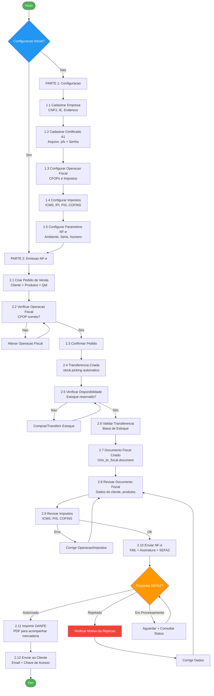
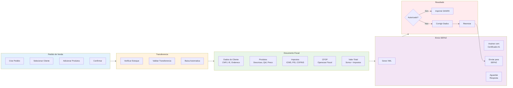
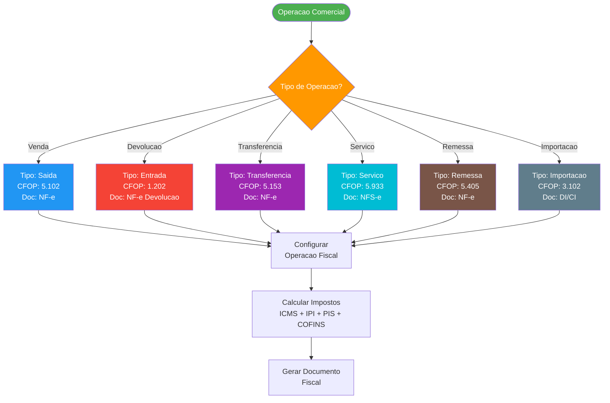
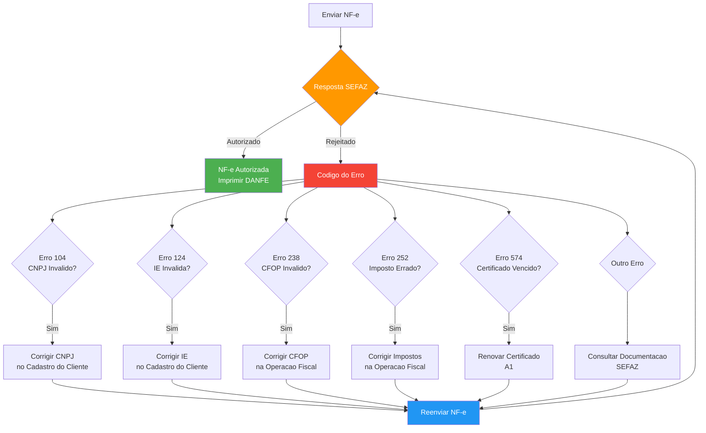
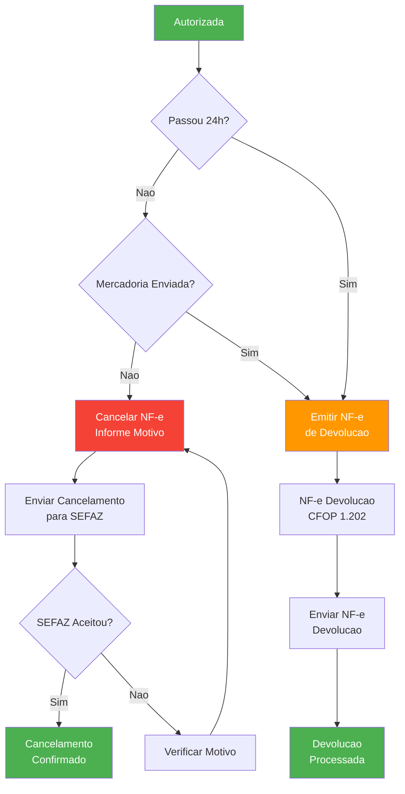
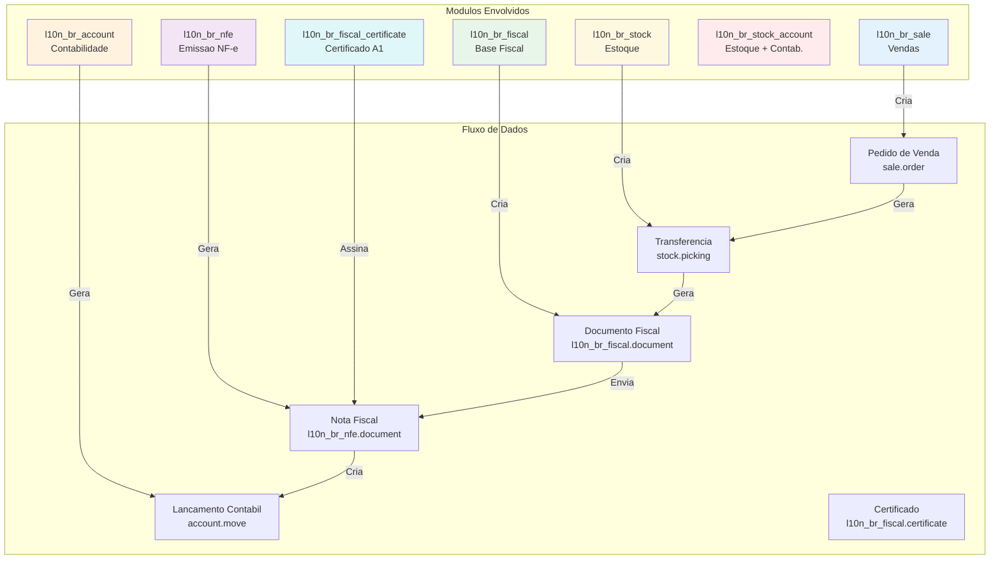

# Fluxo de Emissao de NF-e no Odoo 16

## Fluxo Geral

---

## Fluxo Detalhado — Documento Fiscal

---

## Fluxo de Decisao — Tipo de Documento

---

## Fluxo de Erros e Correcoes

---

## Fluxo de Cancelamento

---

## Fluxo de Integracao entre Modulos

